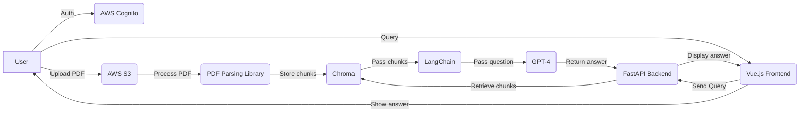

## Approximate architecture

```mermaid
graph LR
    A[User] -->|Auth| B(AWS Cognito)
    A -->|Upload PDF| C(AWS S3)
    C -->|Process PDF| D(PDF Parsing Library)
    D -->|Store chunks| E(Chroma)
    A -->|Query| F(Vue.js Frontend)
    F -->|Send Query| G(FastAPI Backend)
    G -->|Retrieve chunks| E
    E -->|Pass chunks| H(LangChain)
    H -->|Pass question| I(GPT-4)
    I -->|Return answer| G
    G -->|Display answer| F
    F -->|Show answer| A
```