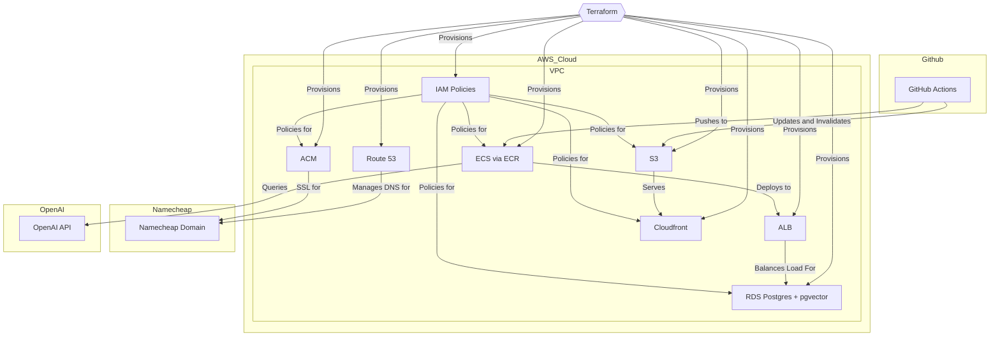

## Infrastructure

This directory contains the Terraform code for the infrastructure that powers the site.

### Setup

1. Create a Terraform Cloud project and set it to only store state.
2. Change the AWS profile name in `main.tf`. (TODO: Move out into `tfvars`)

### Diagram

